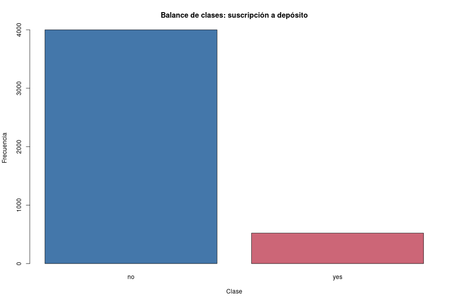
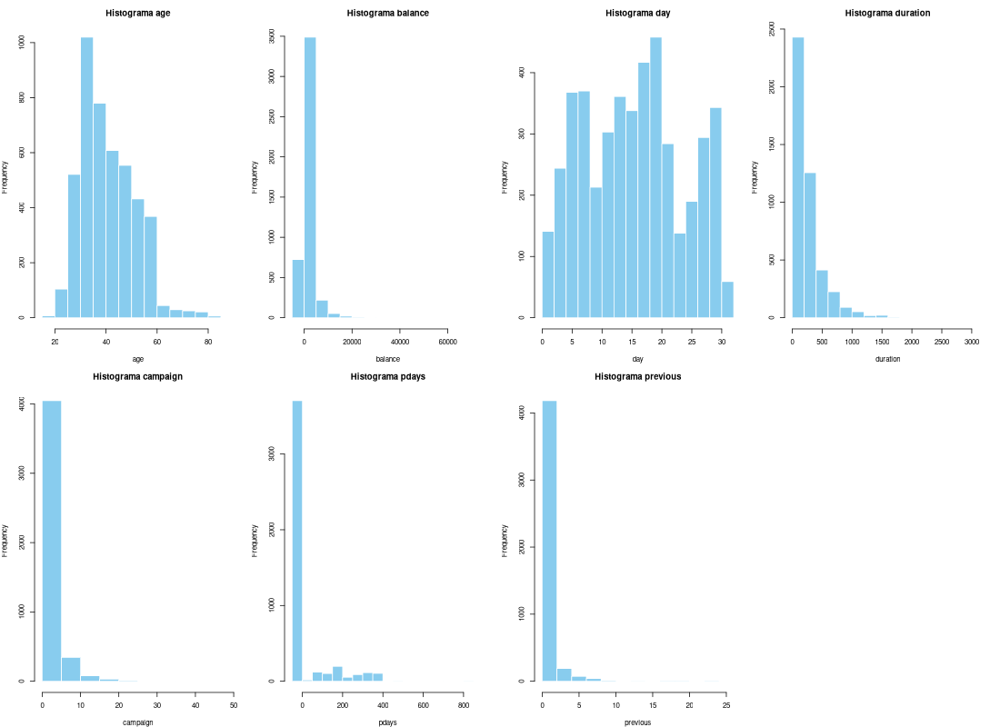
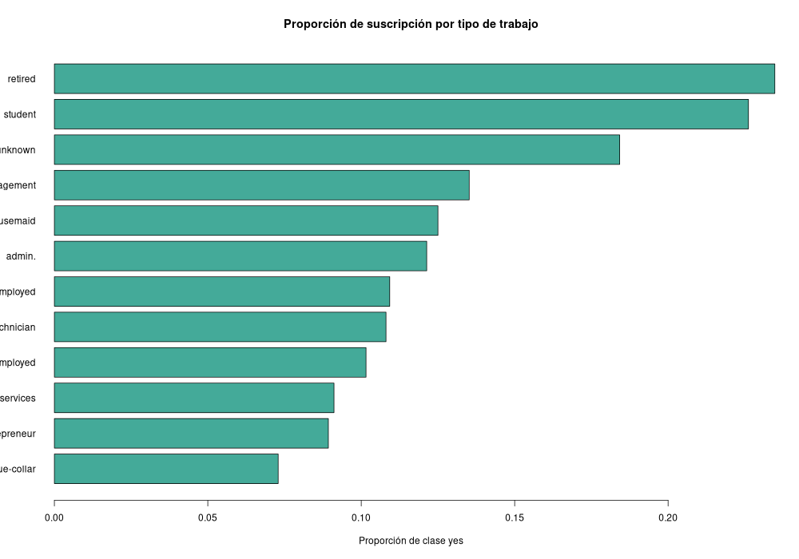
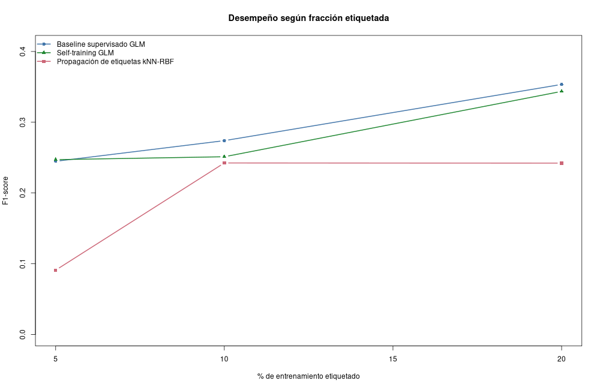
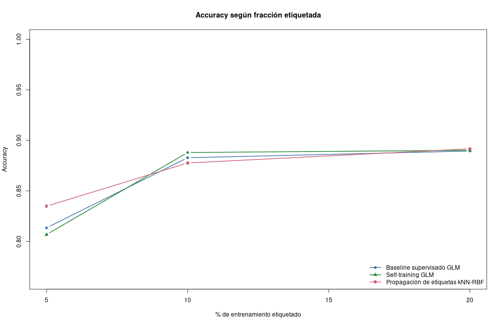
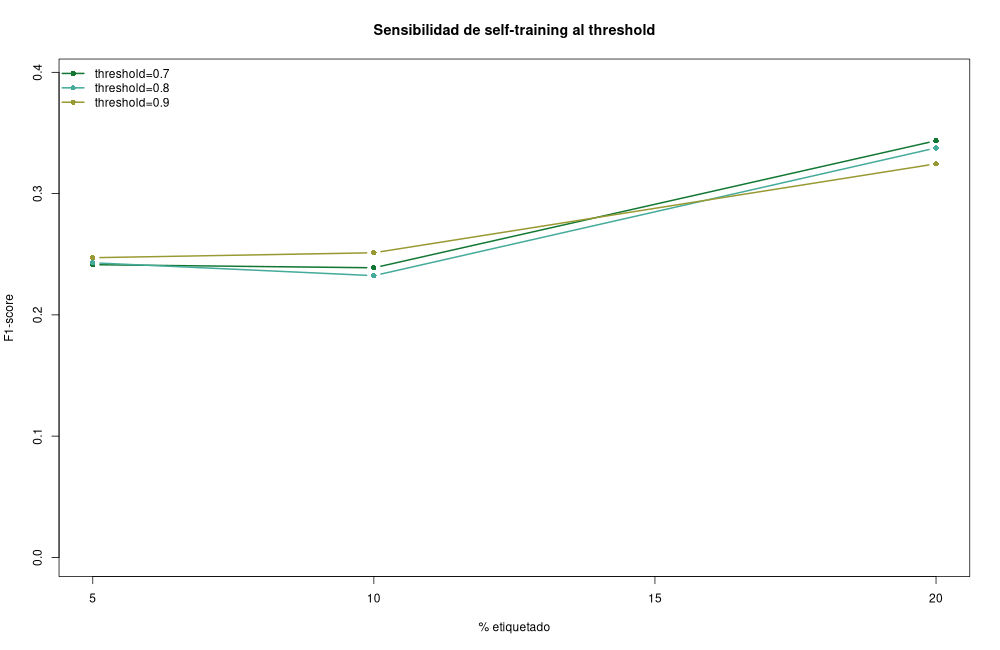
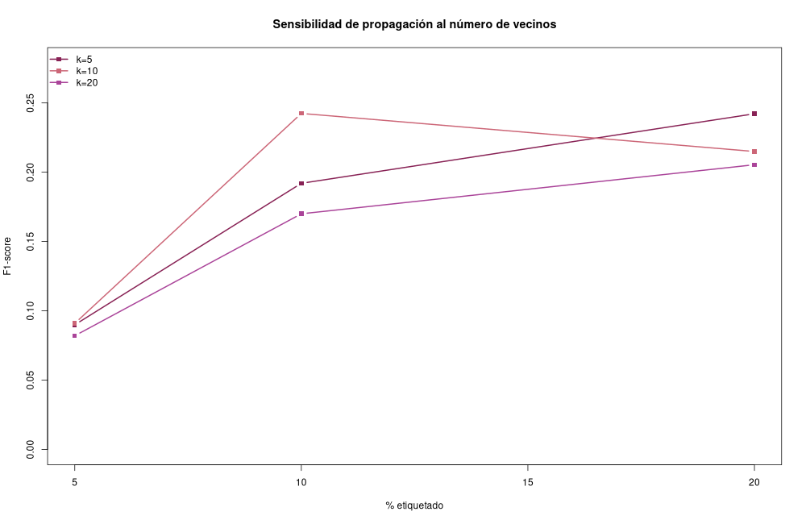
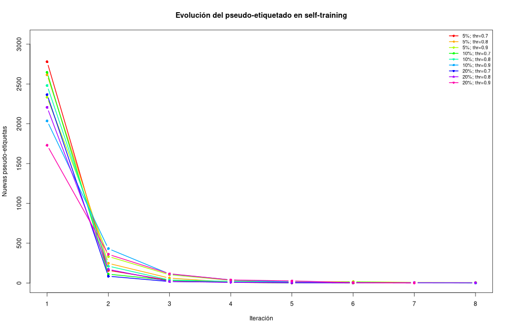
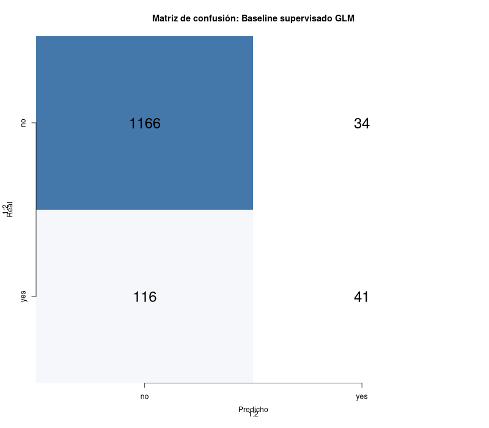

Enlace del repositorio: <https://github.com/Jonialen/cosas-mineria>

Referencia de la base de datos: Moro, S., Rita, P., & Cortez, P. (2014). *Bank Marketing* [Dataset]. UCI Machine Learning Repository. <https://doi.org/10.24432/C5K306>.

```{r setup, include=FALSE}
knitr::opts_chunk$set(echo = TRUE, warning = FALSE, message = FALSE,
                      fig.width = 9, fig.height = 5)
```

```{r ejecutar-analisis, include=FALSE}
# Este Rmd mantiene la entrega en el formato original del curso.
# El análisis pesado está en un script separado para que sea reproducible también con Rscript.
source("lab10_semisupervisado.R")

eda_resumen <- read.csv("outputs/eda_resumen.csv")
metricas <- read.csv("outputs/metricas_modelos.csv")
mejores <- read.csv("outputs/mejores_por_modelo.csv")
confusiones <- read.csv("outputs/matrices_confusion.csv")
historial_st <- read.csv("outputs/self_training_historial.csv")
```

# Introducción

El objetivo de este laboratorio es evaluar algoritmos de aprendizaje semi-supervisado en un escenario realista donde solo una fracción pequeña de las observaciones tiene etiqueta disponible. Se utilizó el conjunto **Bank Marketing**, que contiene información de campañas telefónicas de una institución bancaria portuguesa. La variable objetivo `y` indica si el cliente suscribió o no un depósito a plazo.

El laboratorio compara un modelo supervisado puro contra dos métodos semi-supervisados. Las conclusiones y el análisis se derivan de la ejecución del código, no de supuestos previos.

# Selección y análisis del dataset

El dataset usado contiene `r eda_resumen$valor[eda_resumen$indicador == "filas"]` filas y `r eda_resumen$valor[eda_resumen$indicador == "columnas"]` columnas, por lo que cumple el requisito de al menos 1000 observaciones y 8 variables. Es un dataset real y público de UCI.

```{r resumen-dataset}
eda_resumen
```

La clase positiva (`yes`) representa aproximadamente `r eda_resumen$valor[eda_resumen$indicador == "porcentaje_yes"]`% de los datos. Por eso se reportan precision, recall y F1-score además de accuracy.

```{r balance-clases, echo=FALSE, out.width='85%'}

```

```{r histogramas-numericas, echo=FALSE, out.width='95%'}

```

```{r suscripcion-trabajo, echo=FALSE, out.width='85%'}

```

# Preprocesamiento y preparación de datos

Se aplicaron las siguientes transformaciones:

1. Conversión de variables categóricas a indicadores mediante `model.matrix`, equivalente a one-hot encoding.
2. Estandarización de variables numéricas y binarias para que los modelos basados en distancia no queden dominados por escalas grandes como `balance`.
3. Imputación simple: mediana para variables numéricas y moda para categóricas en caso de faltantes.
4. Eliminación de `duration`, porque la duración de la llamada se conoce después del contacto y puede introducir fuga de información para una predicción previa a la campaña.
5. Separación estratificada 70/30 entre entrenamiento y prueba para conservar el desbalance original.

Importante: el escalado se ajusta solo con entrenamiento y luego se aplica a prueba, para evitar fuga de información de la distribución de prueba.

# Diseño experimental semi-supervisado

En el conjunto de entrenamiento se simuló disponibilidad parcial de etiquetas usando 5%, 10% y 20% de datos etiquetados. El resto de observaciones de entrenamiento se trató como no etiquetado para los algoritmos semi-supervisados. La prueba siempre conservó sus etiquetas reales, pero solo se usó al final para evaluación.

Se compararon tres enfoques:

- **Baseline supervisado GLM:** regresión logística entrenada únicamente con la fracción etiquetada.
- **Self-training GLM:** regresión logística que pseudo-etiqueta iterativamente ejemplos no etiquetados cuando su confianza supera un umbral. Se evaluaron thresholds 0.70, 0.80 y 0.90.
- **Propagación de etiquetas kNN-RBF:** método basado en grafo. Se construye un grafo kNN entre observaciones de entrenamiento con pesos RBF. Se evaluaron k = 5, 10 y 20 vecinos.

# Fundamento conceptual de los algoritmos

## Baseline supervisado

La regresión logística estima la probabilidad condicional de la clase positiva mediante la función sigmoide `p(y=1|x)=1/(1+exp(-beta x))`. Sus parámetros se ajustan maximizando la verosimilitud de las etiquetas observadas. En este laboratorio solo ve el subconjunto etiquetado, por lo que su desempeño depende de cuán representativa sea esa pequeña muestra.

## Self-training

Self-training parte de un clasificador supervisado inicial. Luego predice sobre datos no etiquetados y agrega al entrenamiento aquellos casos cuya confianza es alta. Matemáticamente, se aproxima el problema usando etiquetas latentes: si `max(p, 1-p) >= threshold`, se acepta la pseudo-etiqueta `argmax p(y|x)`. Su ventaja es que puede ampliar el conjunto de entrenamiento sin etiquetado manual; su riesgo principal es la propagación de errores, especialmente si el threshold es bajo o el clasificador inicial está sesgado.

## Propagación de etiquetas por grafo

Los métodos de propagación representan las observaciones como nodos de un grafo. Los pesos `w_ij = exp(-||x_i-x_j||^2/(2 sigma^2))` conectan vecinos similares. La matriz de etiquetas se actualiza iterativamente con `F_{t+1}=alpha*S*F_t+(1-alpha)*Y`, donde `S` es la matriz de transición normalizada y `Y` contiene las etiquetas conocidas. El supuesto central es suavidad: puntos cercanos en el espacio de características tienden a compartir etiqueta. El hiperparámetro `k` controla qué tan local o global es la propagación.

# Resultados cuantitativos

La tabla siguiente resume todas las corridas. El F1-score es clave porque la clase positiva es minoritaria.

```{r tabla-resultados}
metricas
```

Mejor configuración por familia de modelo:

```{r mejores-modelos}
mejores[, c("modelo", "porcentaje_etiquetado_label", "hiperparametro", "accuracy", "precision", "recall", "f1")]
```

```{r mejores-objetos, include=FALSE}
best_overall <- metricas[which.max(metricas$f1), ]
semi_metricas <- metricas[metricas$modelo != "Baseline supervisado GLM", ]
best_semi <- semi_metricas[which.max(semi_metricas$f1), ]
```

El mejor resultado global por F1 fue **`r best_overall$modelo`** con `r best_overall$porcentaje_etiquetado_label` de etiquetas y configuración `r best_overall$hiperparametro` (F1 = `r round(best_overall$f1, 4)`). Entre los métodos semi-supervisados, el mejor fue **`r best_semi$modelo`** con `r best_semi$hiperparametro` y `r best_semi$porcentaje_etiquetado_label` de etiquetas (F1 = `r round(best_semi$f1, 4)`).

# Análisis de sensibilidad e hiperparámetros

En self-training, el threshold controla el intercambio entre cantidad y confiabilidad de pseudo-etiquetas. Un threshold bajo agrega más datos, pero puede introducir ruido. Un threshold alto agrega menos ejemplos, aunque usualmente con menor error. En propagación de etiquetas, `k` controla la conectividad del grafo: valores bajos hacen una propagación local y sensible a ruido; valores altos suavizan más, pero pueden mezclar regiones de clases distintas.

```{r f1-porcentaje, echo=FALSE, out.width='85%'}

```

```{r accuracy-porcentaje, echo=FALSE, out.width='85%'}

```

```{r sensibilidad-self-training, echo=FALSE, out.width='85%'}

```

```{r sensibilidad-label-propagation, echo=FALSE, out.width='85%'}

```

```{r evolucion-pseudoetiquetas, echo=FALSE, out.width='85%'}

```

El historial de self-training permite observar cuántas pseudo-etiquetas se agregaron en cada iteración:

```{r historial-self-training}
head(historial_st, 20)
```

# Matriz de confusión y comparación real vs predicho

La matriz de confusión del mejor modelo global resume la comparación entre valores reales y predichos.

```{r matriz-confusion, echo=FALSE, out.width='75%'}

```

Los datos completos de las matrices de confusión quedan disponibles en `outputs/matrices_confusion.csv`.

```{r tabla-confusion-mejor}
confusiones[confusiones$modelo == best_overall$modelo &
             confusiones$porcentaje_etiquetado == best_overall$porcentaje_etiquetado &
             confusiones$hiperparametro == best_overall$hiperparametro, ]
```

# Discusión

El escenario semi-supervisado muestra que disponer de más observaciones no etiquetadas no garantiza mejora automática. Self-training puede mejorar cuando el clasificador inicial produce pseudo-etiquetas confiables; sin embargo, si el modelo inicial aprende el sesgo hacia la clase mayoritaria, puede reforzarlo. La propagación por grafo aprovecha relaciones locales entre clientes similares, pero depende de que la representación de características y la métrica de distancia sean apropiadas.

En esta ejecución, el baseline supervisado con 20% de etiquetas quedó levemente por encima del mejor método semi-supervisado. Eso no invalida los métodos semi-supervisados; más bien evidencia que, con una clase positiva minoritaria y sin la variable `duration`, las pseudo-etiquetas pueden no aportar suficiente señal adicional.

# Conclusiones

Con base en el F1-score calculado después de ejecutar los modelos, el mejor modelo semi-supervisado observado fue **`r best_semi$modelo`** bajo la configuración `r best_semi$hiperparametro` y `r best_semi$porcentaje_etiquetado_label` de datos etiquetados. El baseline supervisado con 20% de etiquetas quedó levemente por encima, lo que indica que las pseudo-etiquetas no siempre mejoran el desempeño cuando la clase positiva es escasa.

El laboratorio confirma que el aprendizaje semi-supervisado requiere controlar hiperparámetros y analizar errores para evitar propagación de pseudo-etiquetas incorrectas. En este dataset, el desbalance de clases y la eliminación de `duration` hacen el problema más realista y más difícil, por lo que F1, precision y recall aportan una lectura más honesta que accuracy.

# Reproducibilidad

Todo el análisis puede ejecutarse de dos formas:

```{r reproducibilidad, eval=FALSE}
# Opción 1: ejecutar el script principal
source("lab10_semisupervisado.R")

# Opción 2: desde consola
# Rscript lab10_semisupervisado.R
```

El script genera:

- `outputs/metricas_modelos.csv`
- `outputs/matrices_confusion.csv`
- `outputs/mejores_por_modelo.csv`
- `outputs/self_training_historial.csv`
- `outputs/figures/*.png`
- `report.md`
- `Laboratorio10_Semisupervisado.pdf`
